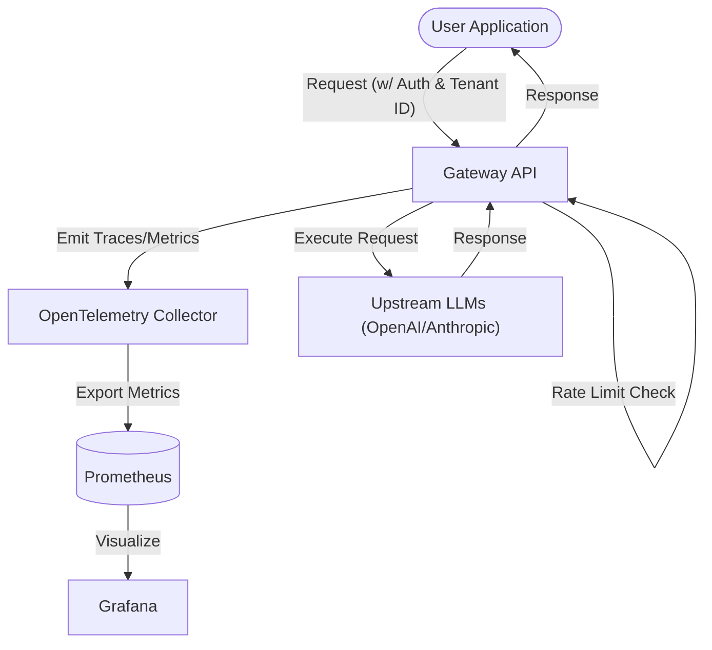

# Architecture — llm-gateway-observability
> Last updated: 2026-08-29 | Maturity: Full Prototype
> _Observability layer and proxy gateway for LLM requests._

## System Diagram
The following Mermaid.js sequence diagram maps the core workflow and interactions:

## Component Table

| Component | File | Responsibility | Tech |
|---|---|---|---|
| Gateway Server | `src/server.ts` | Express server acting as the proxy | TypeScript/Node.js |
| Telemetry Engine | `src/telemetry.ts` | OTel instrumentation (Traces & Metrics) | OpenTelemetry |
| Rate Limiter | `src/rateLimit.ts` | Enforces tenant-level quotas | Redis/In-Memory |

## Port Assignments

| Service | Port | Notes |
|---|---|---|
| Gateway API | `3000` | Main entrypoint |
| OTel Collector | `4317` | gRPC receiver |
| Prometheus | `9090` | Metrics store |
| Grafana | `3001` | Dashboard UI |

## Dependency Honesty Table

| Dependency | Status | Notes |
|---|---|---|
| OpenTelemetry | **Real** | Full OTel stack configured via Docker Compose. |
| Upstream LLMs | **Optional** | E2E provider contract tests hit real APIs; unit tests use mocks. |
